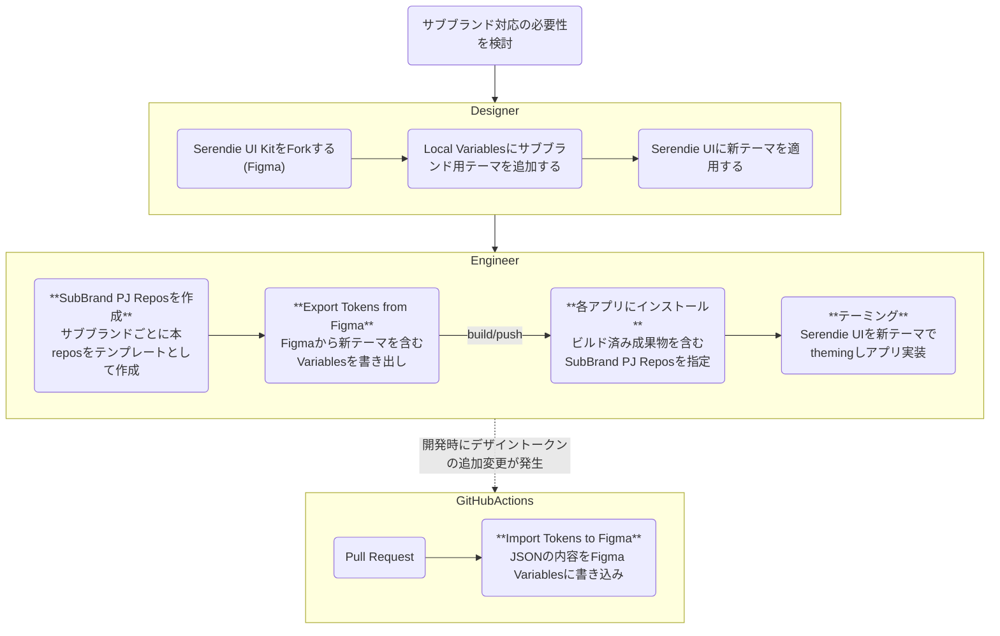

# SDS SubBrands Template

> [!WARNING]
> この内容は三菱電機社内での利用を想定しています。Figma REST APIをベースにしており、Figmaのエンタープライズプラン契約が必要になります。
> 利用時にはSDSチームのサポートを受けてください。

[Serendie Design System (SDS)](https://serendie.design/)が提供するデザイントークンやUIコンポーネントは、[Serendie](https://www.mitsubishielectric.co.jp/serendie/)のVisual Identity (VI)を継承しています。そのため、事業ブランド(サブブランド)ごとにVIが定義されている場合は、Serendieブランドのカラーやタイポグラフィは適さない場合があります。このサブブランド対応の仕組みを使うことで、SDSの導入メリットはそのままに各事業のVIを採用することができます。

- 独自のテーマを定義し、Serendie UIをテーミング
- デザイントークンを定義したJSONファイルとFigma Variablesの同期


## Flow



上記フローのうち、デザイナーによる新テーマ定義が終わり、エンジニアの開発スタート以降を詳しく紹介します。

## 事前準備

### サブブランド用のプライベートリポジトリ作成

> [!WARNING]
> Serendieチーム内にリポジトリを追加する際は、SDSチームに依頼してください。
> 仕組み上は各事業部で管理するGitリポジトリ環境等でも利用可能です (GitHub Actions除く)

本リポジトリの[Use this template](https://github.com/new?owner=serendie&template_name=subbrands-template&template_owner=serendie) から、本リポジトリを雛形として新規リポジトリを作成できます。ここで作成したリポジトリで、サブブランド用デザイントークンを管理します。

プライベートリポジトリ作成後、ローカルにcloneしてください。

### パッケージのインストール

作成したサブブランドプロジェクト内のルートで以下のコマンドを実行します。

```bash
npm install
```

### 環境変数の設定

デザイントークンの同期のため、読み込み/書き込み先のFigmaファイルを指定します。サンプルをリネームして、次の2つを設定してください。

```bash
cp .env.example .env
```

- `PERSONAL_ACCESS_TOKEN`
  - Variablesの[Read/Write Scope](https://www.figma.com/developers/api#authentication-scopes)を有するFigmaのpersonal access token
- `FILE_KEY`
  - サブブランド用の新テーマ (Variablesモード) が含まれるFigmaファイルのKey
  - FigmaファイルのURLに含まれます (`https://www.figma.com/file/{FILE_KEY}/...`)

### Figmaからデザイントークンを取得

Figma REST API を使って、Figma Variablesの内容をJSONファイルとして書き出します。デザイントークンの仕様については[こちら](https://github.com/serendie/serendie/tree/main/design-tokens#%E4%BB%95%E6%A7%98)を参照してください。

```bash
npm run sync-figma-to-json
```

### デザイントークンのビルド

[style-dictionary-formatter](https://github.com/serendie/serendie/tree/main/style-dictionary-formatter)を使い、JSONファイルのデザイントークンを、Panda CSS用のトークンやCSS変数などに変換します。
各種トークンファイルは`dist`ディレクトリに生成されます。それらのファイルをコミットしてプッシュしてください。

```bash
npm run generate-design-tokens
```

## 各プロジェクト内でサブブランド用デザイントークンを使う

ここからはサブブランド用デザイントークンを、アプリケーション内で利用する手順を紹介します。

### インストール

サブブランド用リポジトリを指定して、npm installしてください。`{your-subbrand-tokens}`はここまでで作成したリポジトリの名前に置き換えてください。

```bash
npm install github:serendie/{your-subbrand-tokens}
```

### Panda CSSでの利用

ここではPanda CSSを利用した例を紹介します。[Serendie本体のデザイントークン](https://github.com/serendie/serendie/tree/main/design-tokens)と同じように、CSS変数などでもテーミングを行うことができます。

`panda.config.js` に以下のように記述し、生成したトークンをインポートします。

```ts
import subBrandTokens from "@serendie/sub-brand-tokens/panda";

// PandaCSSのtokensとtextStylesが混在しているので分離する
const { textStyles, ...tokens } = subBrandTokens;
// 必要に応じてtokenの内容を拡張する
const extendedTokens = { ...tokens, sizes: tokens.spacing };
```

`panda.config.js` の `presets` に以下のように記述し、SerendiePreset を拡張します。

```ts
export default defineConfig({
  //...snip
  presets: [
    SerendiePreset,
    {
      theme: {
        extend: {
          tokens: extendedTokens,
          textStyles,
        },
      },
    },
  ],
  //...snip
});
```

[serendie/bootcamp に適用した例](https://github.com/serendie/bootcamp/compare/main...example/subbrand)

必要に応じて `panda codegen` を実行すると、ブランドのトークンが更新されプロジェクト内で利用することができます。

## Figma Variablesへの書き込み

デザイントークンを開発/デザイン間の共通言語とするため、開発中にデザイントークン(JSONファイル)に変更が加わった際は、Figma側にも反映してください。

> [!IMPORTANT]
> Figma Variablesの仕様上の制約から、タイポグラフィ及びシャドウに関するトークンはExport(Figma Variablesからの書き出し)の対象外としています。
> 特にタイポグラフィに変更を加えたいケースは、JSONファイルに変更を加えて、ImportすることでFigma側と同期してください。

### Import Figma Variables from JSON

下記コマンドによりFigma REST API を使って手元の JSON ファイルを Figma に同期します。

```bash
npm run sync-figma-from-json
```

### GitHub Actions で自動化

`.github/workflows/sync-figma-from-json.yml`により、GitHub Actionsで上記を自動化することができます。

GitHub Actions を実行する際にはいくつかの環境変数を設定する必要があります。レポジトリの設定画面から、`Secrets and variables` に以下の環境変数を設定してください。

Serendie のプライベートなパッケージを利用する場合は、`ACCESS_GITHUB_PACKAGES_TOKEN` を設定してください。
Figma の API トークンは、`SYNC_FIGMA_PERSONAL_ACCESS_TOKEN` として設定してください。また、`SYNC_FIGMA_FILE_KEY` には、Figma のファイルキーを設定してください。
