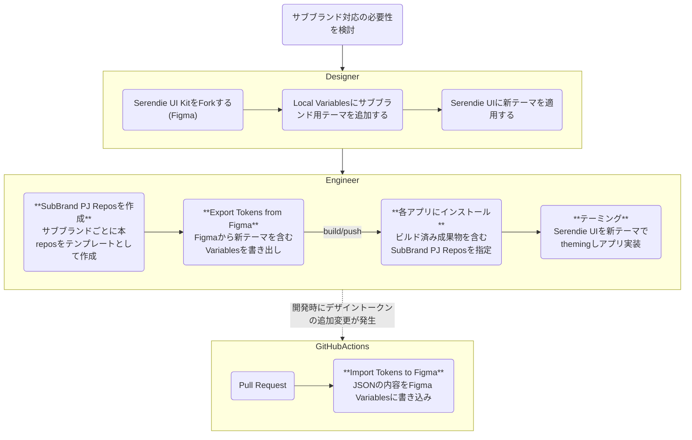

# SDS SubBrands Template

> [!WARNING]
> この内容は三菱電機社内での利用を想定しています。Figma REST APIをベースにしており、Figmaのエンタープライズプラン契約が必要になります。
> 利用時にはSDSチームのサポートを受けてください。

[Serendie Design System (SDS)](https://serendie.design/)が提供するデザイントークンやUIコンポーネントは、[Serendie](https://www.mitsubishielectric.co.jp/serendie/)のVisual Identity (VI)を継承しています。そのため、事業ブランド(サブブランド)ごとにVIが定義されている場合は、Serendieブランドのカラーやタイポグラフィは適さない場合があります。このサブブランド対応の仕組みを使うことで、SDSの導入メリットはそのままに各事業のVIを採用することができます。

- 独自のテーマを定義し、Serendie UIをテーミング
- デザイントークンを定義したJSONファイルとFigma Variablesと同期


## Flow



# Serendie UI にブランド独自のトークンを追加する

Figma の local variables、または JSON ファイルに記述したデザイントークンを、PandaCSS のトークンや CSS 変数などに変換し、ブランド独自のトークンを serendie/ui を使ったプロジェクトに追加することができます。

## 初期設定

GitHub の「Use this template」から、リポジトリを作成しローカルにクローンします。

## .npmrc の作成

サンプルをリネームしてください。
プライベートなレポジトリを参照する必要がある場合は\_authToken を設定してください。
(すでに同様の設定がローカルにされている場合は必要ありません)

```bash
cp .npmrc.example .npmrc
```

## パッケージのインストール

レポジトリのルートで以下のコマンドを実行します。

```bash
npm install
```

## 環境変数の設定

Figma の API トークンとファイルキーを環境変数に設定します。

```bash
cp .env.example .env
```

- PERSONAL_ACCESS_TOKEN
  - Figma の API トークン
- FILE_KEY
  - Figma のファイルキー

## Figma からデータを取得

Rest API を使って Figma のデータを取得し、JSON ファイルに保存します。

```bash
npm run sync-figma-to-json
```

## デザイントークンの生成

style-dictionary を使って、JSON ファイルに保存したデザイントークンを PandaCSS のトークンや CSS 変数などに変換します。

```bash
npm run generate-design-tokens
```

## 生成したトークンを serendie/ui を含むプロジェクトで使う

各種トークンファイルは dist ディレクトリに生成されます。
それらのファイルをコミットしてプッシュしてください。
外部プロジェクトではこれらのファイルをインストールして使用します。

### プロジェクトにこのリポジトリをインストールします。

```bash
# GitHubリポジトリから直接インストール
npm install github:serendie/sub-brand-tokens
```

実際は以下のようなルールのパスになります。

```bash
npm install github:{owner}/{repo}
```

### PandaCSS のトークンをインポートします。

`panda.config.js` に以下のように記述し、生成したトークンをインポートします。

```ts
import subBrandTokens from "@serendie/sub-brand-tokens/panda";

// PandaCSSのtokensとtextStylesが混在しているので分離する
const { textStyles, ...tokens } = subBrandTokens;
// 必要に応じてtokenの内容を拡張する
const extendedTokens = { ...tokens, sizes: tokens.spacing };
```

`panda.config.js` の `presets` に以下のように記述し、SerendiePreset を拡張します。

```ts
export default defineConfig({
  //...snip
  presets: [
    SerendiePreset,
    {
      theme: {
        extend: {
          tokens: extendedTokens,
          textStyles,
        },
      },
    },
  ],
  //...snip
});
```

[serendie/bootcamp に適用した例](https://github.com/serendie/bootcamp/compare/main...example/subbrand)

必要に応じて `panda codegen` を実行すると、ブランドのトークンが更新されプロジェクト内で利用することができます。

## JSON ファイルを Figma に同期

Rest API を使って手元の JSON ファイルを Figma に同期します。

```bash
npm run sync-figma-from-json
```

### GitHub Actions で自動化

.github/workflows/sync-figma-from-json.yml により、GitHub Actions で自動化することができます。

GitHub Actions を実行する際にはいくつかの環境変数を設定する必要があります。
レポジトリの設定画面から、`Secrets and variables` に以下の環境変数を設定してください。

Serendie のプライベートなパッケージを利用する場合は、`ACCESS_GITHUB_PACKAGES_TOKEN` を設定してください。
Figma の API トークンは、`SYNC_FIGMA_PERSONAL_ACCESS_TOKEN` として設定してください。
また、`SYNC_FIGMA_FILE_KEY` には、Figma のファイルキーを設定してください。
